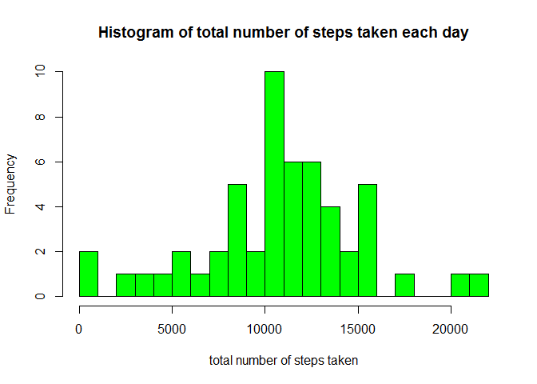
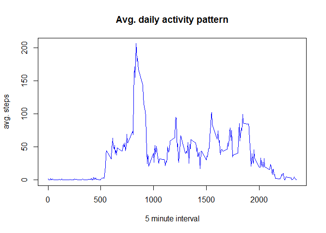
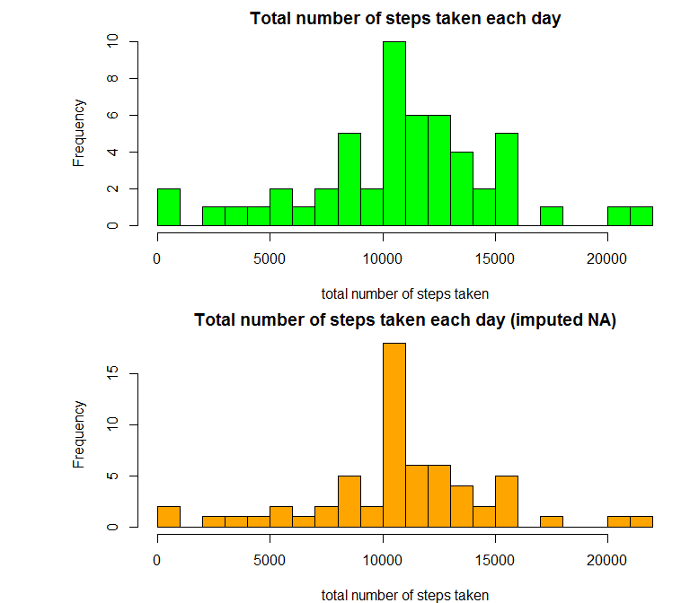
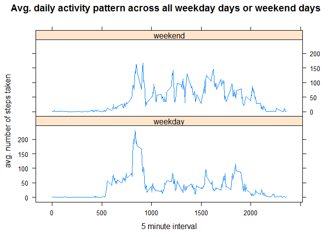

# Reproducible Research: Peer Assessment 1

****
  
## Loading and preprocessing the data
Show any code that is needed to:

1. Load the data (i.e. read.csv()).
2. Process/transform the data (if necessary) into a format suitable for your analysis.

```r
activity<-read.csv("activity/activity.csv")
#Check the data
head(activity)
```

```
##   steps       date interval
## 1    NA 2012-10-01        0
## 2    NA 2012-10-01        5
## 3    NA 2012-10-01       10
## 4    NA 2012-10-01       15
## 5    NA 2012-10-01       20
## 6    NA 2012-10-01       25
```

```r
summary(activity)
```

```
##      steps                date          interval     
##  Min.   :  0.00   2012-10-01:  288   Min.   :   0.0  
##  1st Qu.:  0.00   2012-10-02:  288   1st Qu.: 588.8  
##  Median :  0.00   2012-10-03:  288   Median :1177.5  
##  Mean   : 37.38   2012-10-04:  288   Mean   :1177.5  
##  3rd Qu.: 12.00   2012-10-05:  288   3rd Qu.:1766.2  
##  Max.   :806.00   2012-10-06:  288   Max.   :2355.0  
##  NA's   :2304     (Other)   :15840
```

```r
str(activity)
```

```
## 'data.frame':	17568 obs. of  3 variables:
##  $ steps   : int  NA NA NA NA NA NA NA NA NA NA ...
##  $ date    : Factor w/ 61 levels "2012-10-01","2012-10-02",..: 1 1 1 1 1 1 1 1 1 1 ...
##  $ interval: int  0 5 10 15 20 25 30 35 40 45 ...
```

```r
#Convert into date format
activity$date<-as.Date(activity$date, "%Y-%m-%d")
```

<br> 

## What is mean total number of steps taken per day?
For this part of the assignment, you can ignore the missing values in the dataset.

1. Calculate the total number of steps taken per day
2. If you do not understand the difference between a histogram and a barplot, research the difference between them. Make a histogram of the total number of steps taken each day

```r
activityComp<-activity[complete.cases(activity),]
totSteps<-tapply(activityComp$steps,activityComp$date,sum)
totSteps<-data.frame(date=names(totSteps),total_steps=totSteps)
hist(totSteps$total_steps,main="Histogram of total number of steps taken each day",xlab="total number of steps taken",col="green",breaks=20)
```



3. Calculate and report the mean and median of the total number of steps taken per day

```r
summary(totSteps$total_steps)[3:4]
```

```
## Median   Mean 
##  10760  10770
```

<br>

## What is the average daily activity pattern?
1. Make a time series plot (i.e. type = "l") of the 5-minute interval (x-axis) and the average number of steps taken, averaged across all days (y-axis)

```r
library(dplyr)
avgSteps<-activityComp %>%
      group_by(interval) %>%
      summarize(steps=mean(steps))

plot(avgSteps$interval,avgSteps$steps,main="Avg. daily activity pattern",xlab="5 minute interval",ylab="avg. steps", type="l",col="blue")
```




2. Which 5-minute interval, on average across all the days in the dataset, contains the maximum number of steps?

```r
avgSteps[which.max(avgSteps$steps),]
```

```
## # A tibble: 1 × 2
##   interval    steps
##      <int>    <dbl>
## 1      835 206.1698
```

The interval **835** contains, on average, the highest number of steps.

<br>

## Imputing missing values
Note that there are a number of days/intervals where there are missing values (coded as NA). The presence of missing days may introduce bias into some calculations or summaries of the data.

1. Calculate and report the total number of missing values in the dataset (i.e. the total number of rows with NAs)

```r
sum(is.na(activity))
```

```
## [1] 2304
```

2. Devise a strategy for filling in all of the missing values in the dataset. The strategy does not need to be sophisticated. For example, you could use the mean/median for that day, or the mean for that 5-minute interval, etc.


```r
#We are going to use the mean previously calculated for the average daily activity pattern
imputed<-activity
for (i in avgSteps$interval) {
    imputed[imputed$interval == i & is.na(imputed$steps), ]$steps <- 
        avgSteps$steps[avgSteps$interval == i]
}
```

3. Create a new dataset that is equal to the original dataset but with the missing data filled in.


```r
sum(is.na(imputed))
```

```
## [1] 0
```

```r
head(imputed)
```

```
##       steps       date interval
## 1 1.7169811 2012-10-01        0
## 2 0.3396226 2012-10-01        5
## 3 0.1320755 2012-10-01       10
## 4 0.1509434 2012-10-01       15
## 5 0.0754717 2012-10-01       20
## 6 2.0943396 2012-10-01       25
```

4. Make a histogram of the total number of steps taken each day and Calculate and report the mean and median total number of steps taken per day. Do these values differ from the estimates from the first part of the assignment? What is the impact of imputing missing data on the estimates of the total daily number of steps?

```r
totSteps_imp<-imputed %>%
      group_by(date) %>%
      summarize(steps=sum(steps))

par(mfrow=c(2,1),mar=c(4,8,2,1))
#previous distribution
hist(totSteps$total_steps,main="Total number of steps taken each day",xlab="total number of steps taken",col="green",breaks=20)
#new distribution
hist(totSteps_imp$steps,main="Total number of steps taken each day (imputed NA)",xlab="total number of steps taken",col="orange",breaks=20)
```

<!-- -->


```r
summary(totSteps_imp$steps)[3:4]
```

```
## Median   Mean 
##  10770  10770
```

**Mean is exactly the same** in both distribuions. Median is is slightly higher (10770 vs 10760 using complete cases). Imputing missing data using the mean for the corresponding 5-minute-interval (like I did in my analysis), does not change the distribution significantly. In this sense it can be a good strategy in order to keep all the observations. 

<br>

## Are there differences in activity patterns between weekdays and weekends?
For this part the weekdays() function may be of some help here. Use the dataset with the filled-in missing values for this part.

1. Create a new factor variable in the dataset with two levels - "weekday" and "weekend" indicating whether a given date is a weekday or weekend day.

```r
#note I have Italian language setted on my machine
unique(weekdays(imputed$date))
```

```
## [1] "lunedì"    "martedì"   "mercoledì" "giovedì"   "venerdì"   "sabato"   
## [7] "domenica"
```

```r
#Create a function called "day_of_the_week" to do the job and apply it using sapply function.
day_of_the_week<- function(days){
      ifelse(weekdays(days) %in% c("sabato","domenica"), 
             "weekend", 
             "weekday")
      }

imputed$day_of_the_week<- as.factor(sapply(imputed$date,day_of_the_week))
```

2. Make a panel plot containing a time series plot (i.e. type = "l") of the 5-minute interval (x-axis) and the average number of steps taken, averaged across all weekday days or weekend days (y-axis). See the README file in the GitHub repository to see an example of what this plot should look like using simulated data.

```r
avgSteps_imp<-imputed %>%
      group_by(interval,day_of_the_week) %>%
      summarize(steps=mean(steps))
library(lattice)
xyplot(steps ~ interval | day_of_the_week, avgSteps_imp, type = "l", lwd = 1,layout = c(1, 2), 
       xlab = "5 minute interval", 
       ylab = "avg. number of steps taken",
       main = "Avg. daily activity pattern across all weekday days or weekend days")
```



